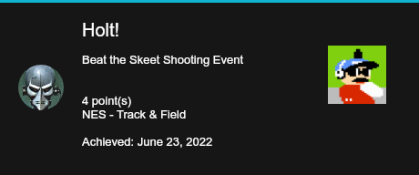

### ra_discordbot


Simple way to get started

1.  Create your application
[Discord guide](https://discordjs.guide/preparations/setting-up-a-bot-application.html#creating-your-bot)
[Discord developer portal](https://discord.com/developers/applications)
Add your bot to your server. [guide](https://discordjs.guide/preparations/adding-your-bot-to-servers.html#bot-invite-links)

2. Create a .env file
Find your Retroachievements api key [here](https://retroachievements.org/controlpanel.php).

```
DISCORD_TOKEN=<Discord Bot Token>
RA_USER=<your retroachievements username>
RA_API=<your retroachievements api key>
```

3. run it

```
docker compose up
```

### commands

If your retroachievement username doesn't match your discord username you need to run register.  Otherwise you will register the first time you run latest or canvas.

```
!register <retroachievements username>
```

latest will look up the latest achievements since it looked last.  It takes an optional discord username if you want to look up another discord user.  They must be registered already.
```
!latest [discord username]
```

canvas will look up the last 10 achievements.  It takes an optional discord username if you want to look up another user.  They must be registered already.

```
!canvas [discord username]
```

### response
The discord bot should respond with an image like this.


